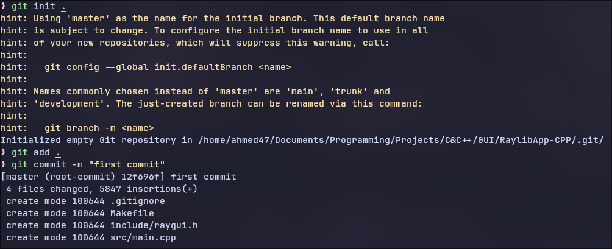
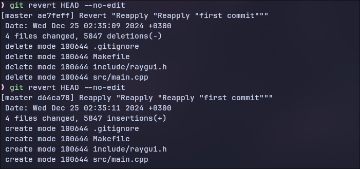

+++
date = '2024-12-26T00:07:54+03:00'
draft = false
title = 'ماهو جِت؟ وكيف تقوم بإستخدامه لإدارة إصدارات المشروع الخاص بك'

tags = ['programming', 'tech']
categories = ['programming', 'tech']

[cover] 
image = "cover-images/git-post/git-post.jpeg" 
alt = "Cover Image"
+++

السلام عليكم ورحمة الله وبركاته عزيزي القارئ الجميل, عُدنا والعود احمدُ في مقالةٍ جديده بعد طول غياب..
وفي هذه المقاله سوف نتكلم عن موضوع جدً مهم لكل مبرمج ألا وهو الجِت "Git" وهو بكل بساطهٍ وإختصار لمن لا يعرفه: **عباره عن برنامج نستخدمه حتى نُدير المشروع وإصداراته** وغالباً يُستخدم مع مواقع لإستضافة المستودعات مثل :
- موقع Github
- موقع Gitlab

وهناك العديد من مواقع إستضافة المستودعات.. ولكن في هذه المقاله لن نتطرق إلى "Github" وكيفية رفع مستودع مشروعك عليه نظراً لأن الموضوع سيكون طويل لذا! قررتُ تقسيم المقاله إلى جزئين :
- جزء لشرح أساسيات "Git" وكيفية إستخدامه محلياً.
- جزء لشرح الـ"Github" وكيفية رفع مشاريعك عليه.

وبسم الله نبدأ...

---
## تهيئة ملف المشروع إلى مستودع محلي
- لتهيئة المجلد الخاص بك حتى يكون مستودع "Git" محلي, فأنت بحاجةٍ إلى كتاب الأمر التالي بداخل المجلد :
```zsh
git init .
```
النقطه التي في نهاية الأمر تعني المجلد الحالي, اي اننا اخبرنا "Git" بتهيئة المجلد الحالي ليكون مستودع محلي.

- لإضافة جميع الملفات التي في المجلد نكتب الأمر التالي :
```zsh
git add .
```

- إذا كان لدينا ملفات او مجلدات ونريد إستبعادها "اي لايتم إضافتها إلى المستودع المحلي الذي قمنا بإنشاءه" نقوم بإنشاء ملف باسم :
```zsh
touch .gitignore
```
> يُفضل إنشاءه قبل عملية إضافة الملفات في الخطوه السابقه.

بعد ذلك تقوم بفتحه بمحرر النصوص الذي تُفضله, على سبيل المثال `neovim`
وتكتب اسماء المجلدات والملفات الذي تُريد ان يتم تجاهلها :
```zsh
# Folders
bin/

# Files
config.bak
```

- والآن إلى الخطوةِ الأخيره, نقوم بعمل تثبيت للتغيرات عبر القيام بعملية `commit` :
```zsh
git commit -m "commit message"
```
الـ"-m" التي في الأمر السابق هو "flag" يُشير إلى الرسالة الخاصه بالعمليه "أي لتوضيح ماتم إضافته او تعديله".

وسيبدو الأمر بعد تنفيذ كل ماسبق هكذا :


---
## للتراجع عن تعديلات معينه
فلنفترض انه في أثناء عملك على المشروع الخاص بك قُمت بإضافة أسطر معينه وتسببت لك بمشاكل, إذن كيف يمكنك التراجع عنها وإستعادة آخر نسخه سليمه؟ بكل بساطه عبر الأمر التالي :
```zsh
git restore .
```
الأمر السابق سوف يقوم بإلغاء اي تعديلات قُمت بها بعد عملية التثبيت `commit`.

ولكن ماذا لو قُمت بعملية تثبيت للتعديلات ثُم بعد ذلك أكتشفت وجود خطأ يُخرب عليك المشروع؟ بكل بساطه يمكنك التراجع عن آخر `commit` قُمت به :
```zsh
git revert HEAD --no-edit
```

صوره توضح العمليه :


---
## الخاتمه
وفي الختام اشكرك جزيل الشُكر ياعزيزي القارئ العسل والجميل على وصولك إلى نهاية المدونه، وأتمنى ان تكون حازت على إعجابك ومن هُنا وحتى لقائنا القادم اتمنى ان تبقى على خيرِ حالٍ وبصحةٍ جيده! وداعاً 🖤.